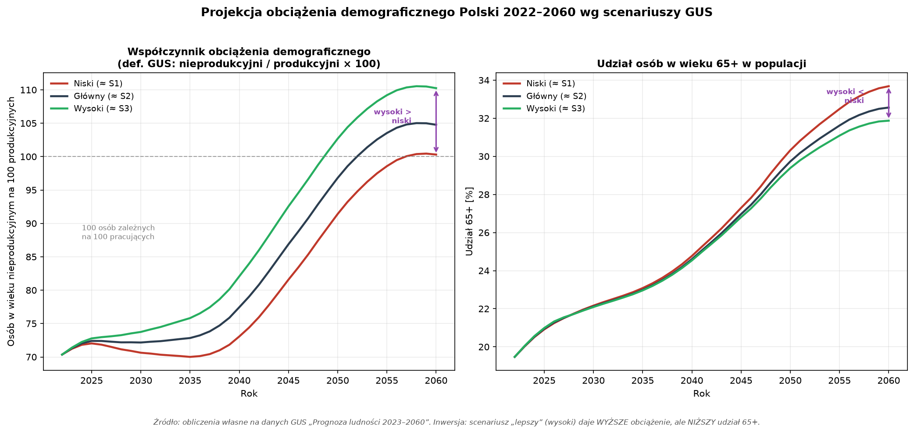

# Projekcja obciążenia demograficznego Polski 2022–2060

## Pytanie

Starzenie się społeczeństwa opisuje się zwykle jednym wskaźnikiem — udziałem osób
65+. Postawiłem inne pytanie: **jak zmieni się obciążenie osób pracujących**, czyli
ilu emerytów i dzieci przypada na 100 osób w wieku produkcyjnym, i **czy różne
scenariusze demograficzne GUS prowadzą do intuicyjnych wyników.**

Odpowiedź okazała się kontrintuicyjna — i to jest główny wynik tej analizy.

## Wynik: scenariusz „lepszy" oznacza wyższe obciążenie pracujących

GUS publikuje trzy scenariusze prognozy ludności do 2060 r.: niski, główny i wysoki
(różnią się założeniami o dzietności, długości życia i migracji). Policzyłem dla
każdego z nich współczynnik obciążenia demograficznego oraz udział osób 65+.

| Wskaźnik w 2060 r. | Niski | Główny | Wysoki |
|---|---:|---:|---:|
| Ludność | 26,7 mln | 30,9 mln | 34,8 mln |
| Udział osób 65+ | 33,7% | 32,6% | 31,9% |
| Obciążenie demograficzne\* | 100 | 105 | **110** |

\* liczba osób w wieku nieprodukcyjnym na 100 osób w wieku produkcyjnym (definicja GUS).
Stan wyjściowy 2022: 70 osób na 100.

**Dwie rzeczy w tej tabeli są zaskakujące:**

Po pierwsze, **scenariusz demograficznie najlepszy (wysoki) ma najwyższe obciążenie
pracujących** — 110 wobec 100 w scenariuszu niskim. Powód: wyższa dzietność i dłuższe
życie dokładają do „obciążenia" jednocześnie więcej dzieci i więcej seniorów, podczas
gdy liczba pracujących rośnie wolniej i z opóźnieniem — dzieci z lat 2030+ wejdą na
rynek pracy dopiero po horyzoncie prognozy. Innymi słowy: sukces prorodzinny najpierw
kosztuje, a dopiero po ~20 latach zwraca się większą liczbą pracujących.

Po drugie, **udział 65+ i obciążenie pracujących idą w przeciwnych kierunkach** między
scenariuszami. W scenariuszu wysokim udział 65+ jest najniższy (31,9%), a mimo to
obciążenie najwyższe — bo większa liczba dzieci „rozcieńcza" odsetek seniorów, choć
w liczbach bezwzględnych obciąża budżet bardziej. To praktyczny wniosek: **pojedynczy
wskaźnik starzenia potrafi wprowadzić w błąd** — te same dane pozwalają „udowodnić"
różne tezy zależnie od tego, który wskaźnik się pokaże.

## Jak to policzyłem

Wskaźniki nie są brane z gotowych tabel GUS — liczę je samodzielnie z surowych danych
o ludności w podziale na **pojedyncze roczniki wieku i płeć** (3 pliki XLSX, ok. 69 tys.
wierszy każdy, poziom powiatowy zagregowany do kraju). Dzięki temu mogłem zastosować
dokładną definicję GUS (granice wieku produkcyjnego różne dla kobiet i mężczyzn) oraz
policzyć alternatywne warianty wskaźnika.

**Walidacja.** Poprawność metody potwierdzam, odtwarzając oficjalną liczbę GUS:
obciążenie w scenariuszu głównym rośnie z 70 (2022) do 105 (2060) — dokładnie tyle,
ile podaje komunikat GUS. Kod zawiera automatyczny test (`assert`), który przerywa
obliczenia, gdyby ta zgodność się zepsuła — zabezpieczenie przed cichym błędem.

**Reprodukowalność.** Cały łańcuch — od surowych plików XLSX po wykres — przechodzi
jednym uruchomieniem notebooka (`notebooks/02_projekcja.ipynb`). Dane źródłowe (~48 MB)
nie są w repozytorium; skąd je pobrać i jak odtworzyć wynik, opisuje
[`data/raw/SOURCES.md`](../data/raw/SOURCES.md).

## Kontekst

Warto odnotować, że **rzeczywistość okazała się gorsza niż najniższy scenariusz**:
prognoza GUS zakładała wzrost dzietności do 1,49 do 2060 r., a faktyczny współczynnik
w 2024 r. wyniósł 1,10 — poniżej dolnej granicy prognozy. To znaczy, że przedstawione
wyżej liczby są raczej optymistyczne niż pesymistyczne.

